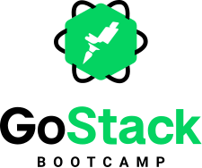

  

  
  
  

  <a href="#️-prerequisites">Prerequisites</a>&nbsp;&nbsp;&nbsp;|&nbsp;&nbsp;&nbsp;
  <a href="#-install-and-run">Install and run</a>&nbsp;&nbsp;&nbsp;|&nbsp;&nbsp;&nbsp;
  <a href="#-license">License</a>

---

 

[Bootcamp GoStack](https://rocketseat.com.br/bootcamp) sixteenth module code 🎓

## ☑️ Prerequisites

- [Node.js](https://nodejs.org/en/) >=
- [Yarn](https://yarnpkg.com) >=

## 🏁 Install and run

1. Clone this repository;
2. Move to the appropriate directory;
3. Run `yarn` to install dependencies.
4. Run `yarn dev`.

## 📝 License

This project is licensed under the MIT License - see the [LICENSE.md](LICENSE.md) file for details.
